# Docker

## 数学与信息学院  何亚康116072017026 

## 前提

本地主机内存大于8G。虚拟机每个1G内存。

## 部署环境：LAMP

操作系统：CentOS 7.2 64位；

参考网站：https://blog.csdn.net/cj1937007583/article/details/77755897

## 先决条件

- 4个服务器节点，都安装了CentOS 7。
- 所有节点上的根权限。

本教程中的服务器将使用以下主机名和IP地址。

  **hostname**        **IP address**

*ceph-admin 192.168.145.142

mon1 192.168.145.143

osd1 192.168.145.145

osd2 192.168.145.144

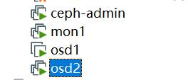

## 步骤

#### 1.创建一个名为“**cephuser**”在所有节点上

```
useradd -d /home/cephuser -m cephuser
passwd cephuser
```


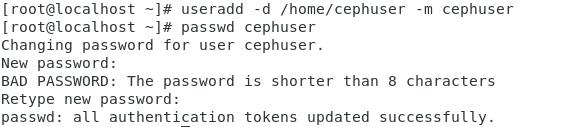


在创建新用户之后，我们需要为“cephuser”配置sudo。他必须能够以root用户的身份运行命令，并且能够在没有密码的情况下获得root权限。

运行下面的命令，为用户创建一个sudoers文件，并使用sed编辑/etc/sudoers文件。

```
echo "cephuser ALL = (root) NOPASSWD:ALL" | sudo tee /etc/sudoers.d/cephuserchmod 0440 /etc/sudoers.d/cephusersed -i s'/Defaults requiretty/#Defaults requiretty'/g /etc/sudoers
```

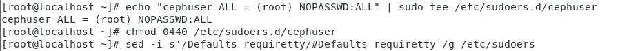

### 安装和配置NTP

安装NTP以同步所有节点上的日期和时间。运行ntpdate命令通过NTP协议设置日期和时间，我们将使用US池NTP服务器。然后启动并启用NTP服务器在启动时运行。

```
yum install -y ntp ntpdate ntp-doc
ntpdate 0.us.pool.ntp.org
hwclock --systohc
systemctl enable ntpd.service
systemctl start ntpd.service
```

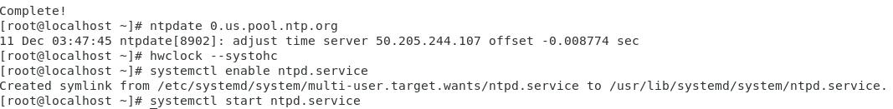

### 安装OpenVM工具

如果您正在运行VMware中的所有节点，则需要安装此虚拟化实用程序。否则跳过这一步。

```
yum install -y open-vm-tools
```

 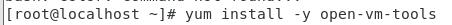

### 禁用SELinux

通过使用sed流编辑器编辑SELinux配置文件，在所有节点上禁用SELinux。

```
sed -i 's/SELINUX=enforcing/SELINUX=disabled/g' /etc/selinux/config
```

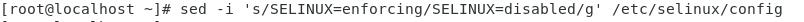

### 配置主机文件

使用vim编辑器编辑所有节点上的/etc/host文件，并添加带有所有集群节点的IP地址和主机名的行。

```
vim /etc/hosts
```

粘贴下面的配置：

```
192.168.145.142        ceph-admin
192.168.145.143        mon1
192.168.145.141        osd1
192.168.145.144       osd2
```

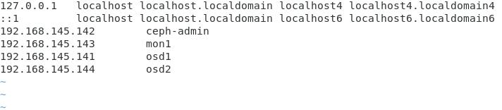

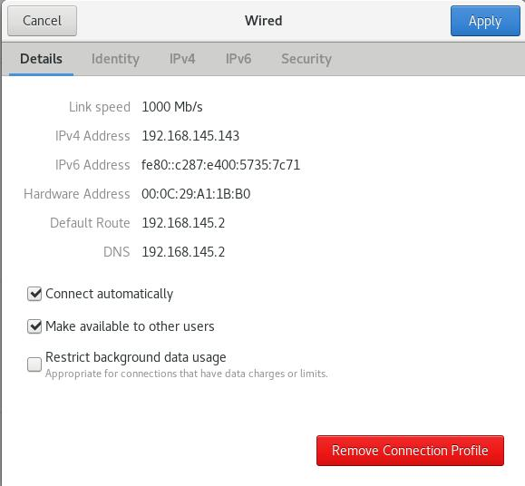

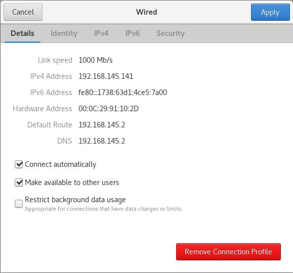

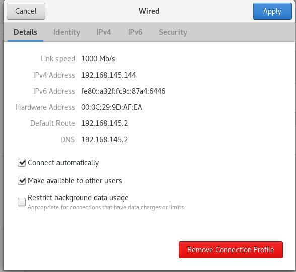

保存文件并退出vim。

现在，您可以尝试在服务器之间使用主机名进行ping，以测试网络连接性。例子：

```
ping -c 5 mon1
```

其中5是发包数 mon1是节点名称


## 步骤2-配置SSH服务器

在这个步骤中，我将配置**Ceph-admin节点**...管理节点用于配置监视器节点和osd节点。登录到Ceph-admin节点，并成为**Cephuser**'.

```
ssh root@ceph-admin
su - cephuser
```

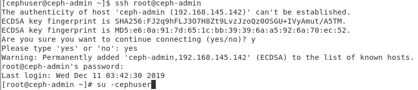

管理节点用于安装和配置所有集群节点，因此Ceph-admin节点上的用户必须拥有连接到所有节点的特权，而不需要密码。我们必须为“Ceph-admin”节点上的“cephuser”配置无密码SSH访问。

生成ssh键**Cephuser**'.

```
ssh-keygen
```

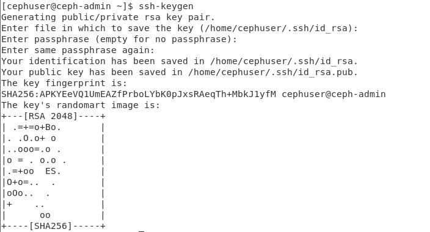

把密码空/空。

接下来，为ssh配置创建配置文件。

```
vim ~/.ssh/config
```

粘贴配置如下：

```
Host ceph-admin        
Hostname ceph-admin        
User cephuser Host mon1        
Hostname mon1        
User cephuser Host osd1       
Hostname osd1        
User cephuser Host osd2        
Hostname osd2        
User cephuser Host osd3        
```

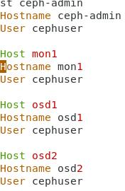

更改配置文件的权限。

```
chmod 644 ~/.ssh/config
```


现在，使用ssh-Copy-id命令将SSH密钥添加到所有节点。

```
ssh-keyscan osd1 osd2 osd3 mon1 client >> ~/.ssh/known_hosts
ssh-copy-id osd1
ssh-copy-id osd2
ssh-copy-id mon1
```

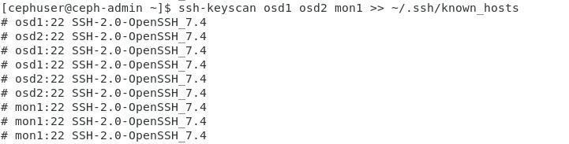

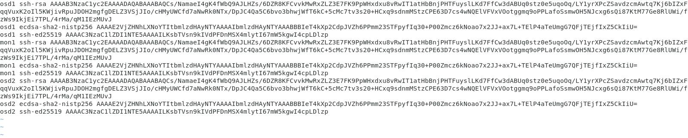

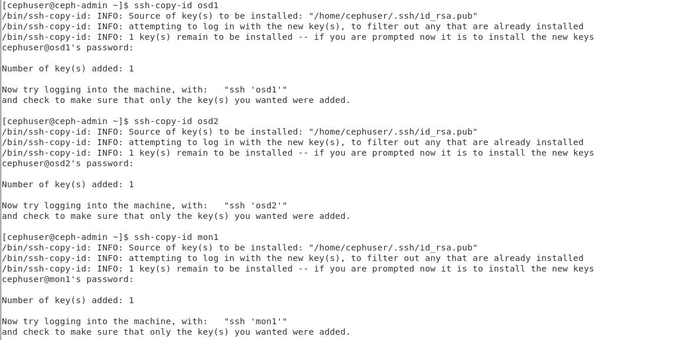

在请求时输入您的“cephuser”密码。


完成后，尝试从Ceph-admin节点访问osd 1服务器。

```
ssh osd1
```


## 步骤3-配置Firewalld

我们将使用Firewalld来保护系统。在这个步骤中，我们将在所有节点上启用Firewald，然后打开Ceph-Admon、Ceph-mon和Ceph-osd所需的端口。

登录到Ceph-admin节点并启动Firewalld。

```
ssh root@ceph-adminsystemctl start firewalldsystemctl enable firewalld
```

打开端口80，2003和4505-4506，然后重新加载防火墙.

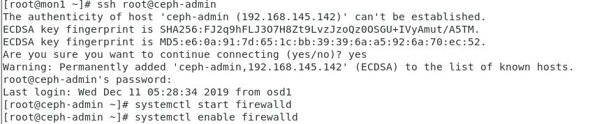

```
sudo firewall-cmd --zone=public --add-port=80/tcp --permanent
sudo firewall-cmd --zone=public --add-port=2003/tcp --permanent
sudo firewall-cmd --zone=public --add-port=4505-4506/tcp --permanent
sudo firewall-cmd --reload
```

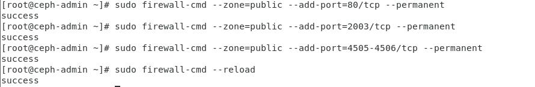

从Ceph-admin节点登录到监视器节点‘mon1’并启动Firewalld。

```
ssh mon1sudo systemctl start firewalldsudo systemctl enable firewalld
```


在CJoseph监视器节点上打开新端口并重新加载防火墙。

```
sudo firewall-cmd --zone=public --add-port=6789/tcp --permanentsudo firewall-cmd --reload
```

最后，开放端口6800-7300对每个osd节点-osd 1，osd 2和os3。

从Ceph-admin节点登录到每个osd节点。

```
ssh osd1sudo systemctl start firewalldsudo systemctl enable firewalld
```

打开端口并重新加载防火墙。

```
sudo firewall-cmd --zone=public --add-port=6800-7300/tcp --permanentsudo firewall-cmd --reload
```

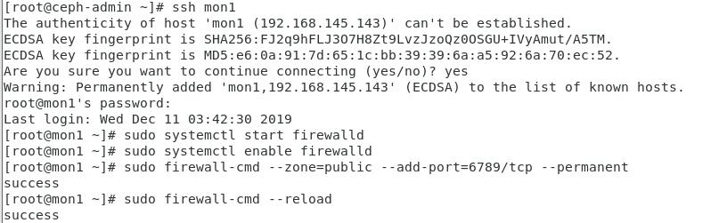

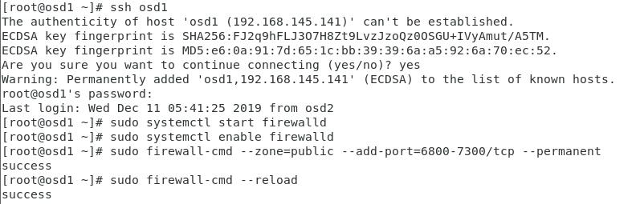


完成了Firewalld配置。

## 步骤4-配置CephOSD节点

在本教程中，我们有3个OSD节点，每个节点有两个分区。

1. **/dev/sda**用于根分区。
2. **/dev/sdb**是一个空分区--在我的例子中是30 GB。

我们会用**/dev/sdb**去找卡夫磁盘。从Ceph-admin节点登录到所有OSD节点，并将/dev/sdb分区格式化为**XFS**.

```
ssh osd1
ssh osd2
ssh osd3
```

首先添加分区

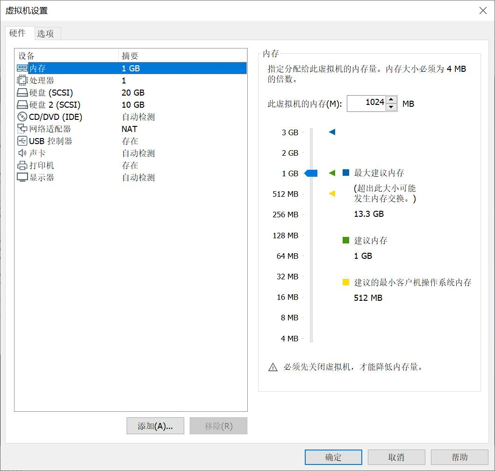

使用fdisk命令检查分区。

```
sudo fdisk -l /dev/sdb
```

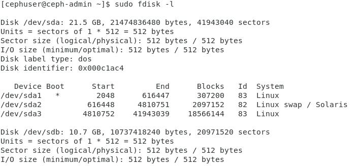

使用Parted命令用XFS文件系统和GPT分区表格式化/dev/sdb分区。

```
sudo parted -s /dev/sdb mklabel gpt mkpart primary xfs 0% 100%
sudo mkfs.xfs /dev/sdb -f
```

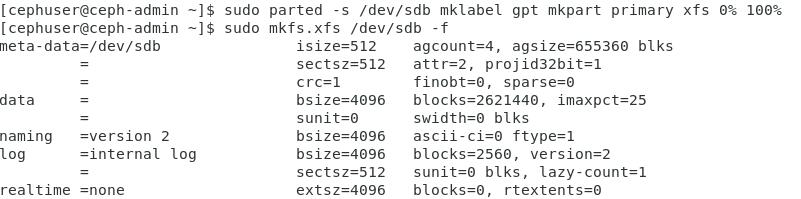


现在检查分区，您将得到XFS/dev/sdb分区。

```
sudo blkid -o value -s TYPE /dev/sdb
```

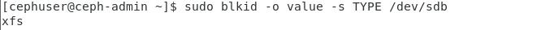

同上步骤完成osd1和osd2

## 步骤5-构建CJoseph集群

在这一步中，我们将在Ceph-admin节点上的所有节点上安装CJoseph。

登录到Ceph-admin节点。

```
ssh root@ceph-admin
su - cephuser
```


### 在Ceph-admin节点上安装CJoseph-Deploy

添加CJoseph存储库并安装CJoseph部署工具‘**Ceph-Deploy**“使用yum命令。

```
sudo rpm -Uhv http://download.ceph.com/rpm-jewel/el7/noarch/ceph-release-1-1.el7.noarch.rpmsudo yum update -y && sudo yum install ceph-deploy -y
```

确保更新所有节点。

查看命令是

```
ceph -v
```

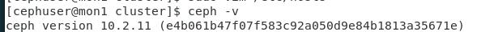

安装了Ceph-Deploy工具之后，为CJoseph集群配置创建一个新目录。

### 创建新的集群Config

创建新的群集目录。

```
mkdir cluster
cd cluster/
```

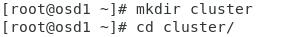

接下来，使用**Ceph-Deploy**命令，将监视器节点定义为**mon1**'.

```
ceph-deploy new mon1
```

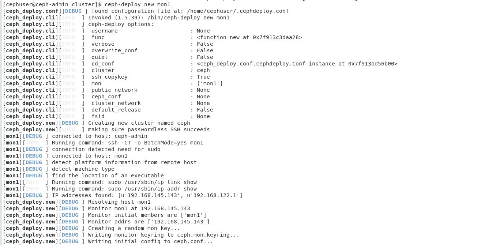

该命令将在集群目录中生成CJoseph集群配置文件“ceph.conf”。

用vim编辑ceph.conf文件。

```
vim ceph.conf
```

在[全局]块下，粘贴下面的配置。

```
# Your network address
public network = 10.0.15.0/24
osd pool default size = 2
```

保存文件并退出vim。


### 在所有节点上安装

现在，在Ceph-admin节点的所有其他节点上安装CJoseph。这可以用一个命令来完成。

```
ceph-deploy install ceph-admin mon1 osd1 osd2
```


该命令将自动在所有节点上安装CJoseph：mon1、osd 1-3和ceph-admin-安装将花费一些时间。

现在，在mon1节点上部署Ceph-mon。

```
ceph-deploy mon create-initial
```

该命令将创建监视器键，使用“CJoseph”命令检查并获取键。

```
ceph-deploy gatherkeys mon1
```

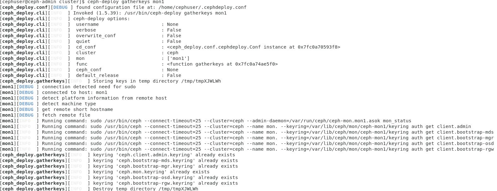


### 在集群中添加OSDS

在所有节点上安装了CJoseph之后，我们可以将OSD守护进程添加到集群中。OSDDaemons将在磁盘/dev/sdb上创建数据和日志分区。

检查/dev/sdb分区在所有OSD节点上是否可用。

```
ceph-deploy disk list osd1 osd2
```


您将看到XFS格式的/dev/sdb磁盘。

接下来，使用zap选项删除所有节点上的/dev/sdb分区表。

```
ceph-deploy disk zap osd1:/dev/sdb osd2:/dev/sdb
```

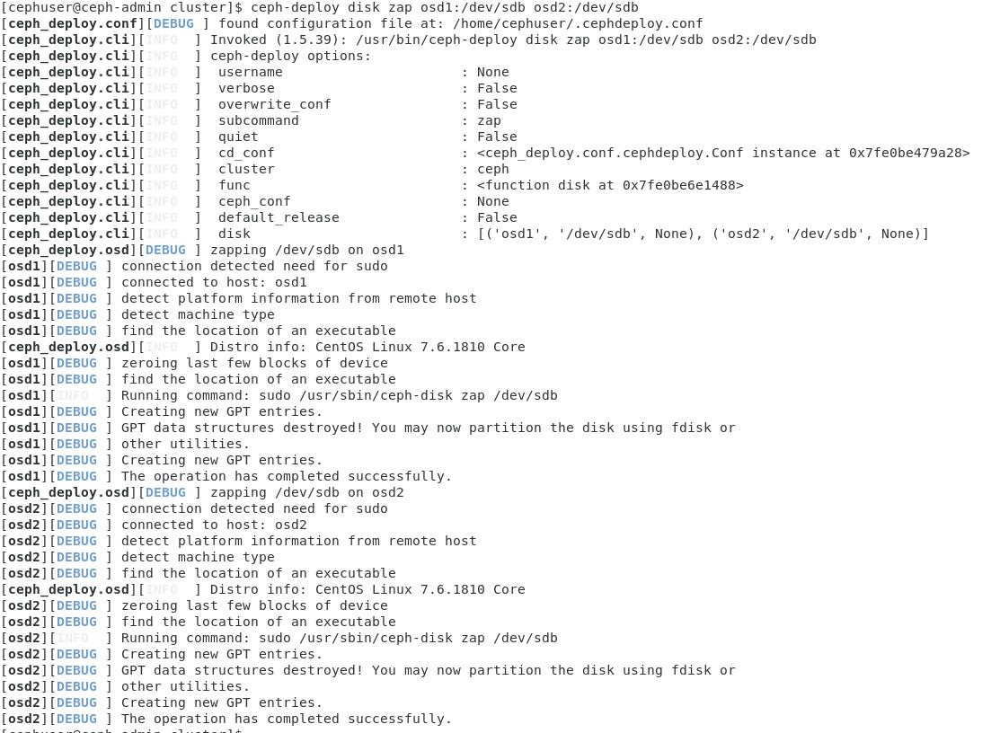

该命令将删除CephOSD节点上/dev/sdb上的所有数据。

现在准备好所有OSDS节点。确保结果中没有错误。

```
ceph-deploy osd prepare osd1:/dev/sdb osd2:/dev/sdb
```

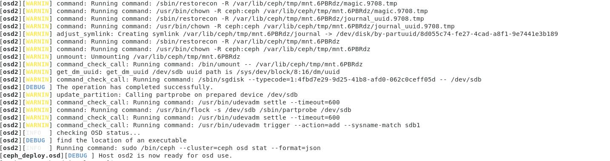

如果您看到osd 1-2已经为OSD使用结果做好了准备，那么部署就成功了。

使用以下命令激活OSD：

```
ceph-deploy osd activate osd1:/dev/sdb1 osd2:/dev/sdb1 
```


在继续之前，请检查输出中是否有错误。现在，您可以使用List命令检查OSD节点上的SDB磁盘。

```
ceph-deploy disk list osd1 osd2
```

结果是/dev/sdb现在有两个分区：

1. **/dev/sdb 1**-CJoseph数据
2. **/dev/sdb 2**-CephJournal

或者您可以直接在使用fdisk的OSD节点上检查。

```
ssh osd1sudo fdisk -l /dev/sdb
```


```
ceph-deploy osd activate osd1:/dev/sdb1 osd2:/dev/sdb1 
```

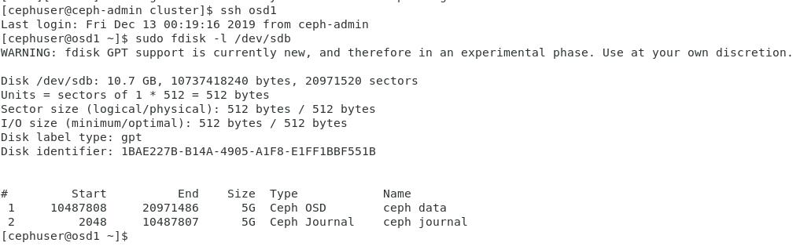

接下来，将管理密钥部署到所有相关节点。

```
ceph-deploy admin ceph-admin mon1 osd1 osd2
```

通过在所有节点上运行下面的命令来更改密钥文件的权限。

```
sudo chmod 644 /etc/ceph/ceph.client.admin.keyring
```

CentOS 7上的CJoseph集群已经创建。

## 步骤6-测试CJoseph设置

在步骤4中，我们已经安装并创建了新的CJoseph集群，然后将OSDS节点添加到集群中。现在，我们可以测试集群，并确保集群设置中没有错误。

从Ceph-admin节点登录到CJoseph监视器服务器‘**单1**'.

```
ssh mon1
```

运行下面的命令以检查群集运行情况。

```
sudo ceph health
```

现在检查群集状态。

```
sudo ceph -s
```

你应该看到下面的结果：

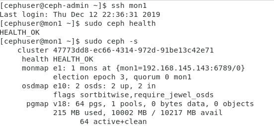


恭喜，你成功地建立了一个新的CJoseph集群。


