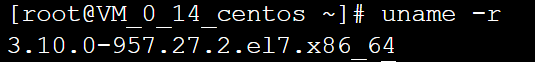

# Docker

## 数学与信息学院  何亚康116072017026 

## 前提

购买腾讯云服务器实例（包含独立的域名并实名认证），参考如何购买腾讯云服务器

## 部署环境：LAMP

云操作系统：CentOS 7.2 64位；
HTTP服务器：Apache Web 服务器；
数据库：MySQL；
建站工具：WordPress（基于PHP）。

## 先决条件

- 已安装CentOS 7，并且内核版本大等于3.10，本文使用的是阿里云的镜像：[CentOS镜像](http://mirrors.aliyun.com/centos/7/isos/x86_64/)。
- 非root用户已获得sudo特权。

使用如下命令查看操作系统内核信息：

## 步骤

#### 1.使用如下命令查看操作系统内核信息：

```
uname -r
```




顺带看一下Linux的版本号：

```
cat /etc/redhat-release
```


可见阿里云镜像保存的是CentOS 7.6。
如果当前用户不能使用sudo权限，登录到root用户，在终端键入：

gpasswd -a user wheel
这里user指代希望授权的用户。该命令将user用户加入“wheel”用户组。在CentOS 7中默认情况下，wheel用户组的用户能够使用sudo命令。
这里笔者已经是root用户了

## 2.安装Docker

CentOS 7的应用程序库可能不是最新的，因此首先更新应用程序数据库：

```
sudo yum check-update
```


接下来添加Docker的官方仓库，下载最新的Docker并安装：

```
curl -fsSL https://get.docker.com/ | sh
```


若报错curl命令不存在则


***启动Docker***

```
sudo systemctl start docker
```


***设置Docker自启动***

```
sudo systemctl enable docker
```


***查看Docker 版本信息***

```
docker version
```


### 2.Docker加载CentOS镜像

***拉取 Centos 7***

```
docker pull centos:7
```


***拉取完毕后查看镜像***

```
docker images
```


***运行Docker容器（为了方便检测后续wordpress搭建是否成功，需设置端口映射（-p），将容器端口80 映射到主机端口8888，Apache和MySQL需要 systemctl 管理服务启动，需要加上参数 --privileged 来增加权，并且不能使用默认的bash，换成 init，否则会提示 Failed to get D-Bus connection: Operation not permitted ，，-name 容器名 ，命令如下 ）***

```
docker run -d -it --privileged --name wordpress -p 8888:80 -d centos:7 /usr/sbin/init
```


***查看已启动的容器***

```
docker ps
```


进入容器前台（容器id可以只写前几位，如 ：d4a）

```
docker exec -it d4a /bin/bash
```


docker start d4a305219ae0fffd37f13fa4deb3a0e9c224c3a01137fbd1add4d6c73e3a465c

### 3.容器中安装wordpress

参照[**CentOS上搭建WordPress博客**](../WordPress_InStall/README.md)（该教程里访问公网IP都需加上端口 :8888)

安装完成后可通过浏览器访问 服务器IP:8888 查看


### 4.推送带有wordpress的镜像

***前往docker hub注册账号，下面需要用到。***

***将容器生成镜像 (所生成的镜像名由 "Docker用户名/Docker仓库名组成" ，否则推送会报错： denied: requested access to the resource is denied )***

```
docker commit -a "Docker用户名" -m "提交描述" 容器id 镜像名:tag标签
# 举例 docker commit -a "1529441996" -m "wordpress on centos7" d4a305219ae0 1529441996/centos:v1
```


***登录Docker***

```
docker login
```


***推送镜像***

```
docker push 镜像名:tag标签
# 举例  docker push 1529441996/centos:v1
```


慢慢等咯